# Praktiskā darba atskaite

---

## 1. Vispārīgā informācija

- Vārds, Uzvārds: Artūrs Šimkūns
- Grupa: PIN_77151_31.03.2026.-09.04.2027.
- Praktiskā darba kods: PB1_PD18
- Datums: 2026-08-08

---

## 2. Darba mērķis

Šajā praktiskajā darbā bija paredzēts apgūt profesionālu darba procesu ar Git, GitHub, GitHub Issues, GitHub Projects un GitHub Actions CI. Darba laikā tika izveidots vienkāršs Python projekts ar funkciju `saskaitit(a, b)`, izveidoti `unittest` testi, iestatīta automātiska testu palaišana pēc `git push`, veikts CI eksperiments ar apzināti sabojātu testu un sagatavota Definition of Done sadaļa.

Praktiskajā darbā nostiprināju izpratni, ka `git push` nav tikai koda nosūtīšana uz GitHub, bet arī automātiskas pārbaudes sākšana. Ja CI statuss ir sarkans, darbs vēl nav pabeigts. Ja CI statuss ir zaļš, tests ir izpildīts veiksmīgi un izmaiņas ir drošākas turpmākai izmantošanai.

---

## 3. Izmantotā vide un rīki

- Operētājsistēma: Windows 11
- Programmas / rīki: Visual Studio Code, PowerShell, Git, GitHub, GitHub Issues, GitHub Projects, GitHub Actions
- Versijas: Python 3.14.5
- Papildu bibliotēkas / servisi: `unittest` iebūvētā Python testēšanas bibliotēka, GitHub Actions CI

---

## 4. Uzdevumu izpilde

---

### 4.1. Uzdevums 1 - Repozitorija un uzdevumu izveide

- Ko darīju:
Izveidoju GitHub repozitoriju `PB1_PD18_Simkuns_Arturs`. GitHub sadaļā `Issues` izveidoju četrus uzdevumus: `Izveidot funkciju saskaitit`, `Uzrakstīt unittest testus`, `Iestatīt GitHub Actions CI`, `Atjaunināt README un Definition of Done`. Pēc tam izveidoju GitHub Projects dēli ar Kanban darba plūsmu. GitHub noklusējuma kolonna `In Progress` tika izmantota kā uzdevumā minētās `Doing` kolonnas praktiskais ekvivalents.

- Izmantotās komandas / darbības:
GitHub repozitorijā atvēru sadaļu `Issues -> New issue` un izveidoju četrus Issues. Pēc tam atvēru `Projects -> New project`, izvēlējos `Board` tipa projektu un ievietoju izveidotos Issues kolonnās `To Do`, `In Progress` un `Done` atbilstoši darba progresam.

Sasaistīju lokālo projekta mapi ar GitHub repozitoriju:

```powershell
git init
git branch -M main
git remote add origin https://github.com/ArtursSimkuns/PB1_PD18_Simkuns_Arturs.git
```

Sākotnējai projekta struktūrai izveidoju nepieciešamos failus un mapes:

```powershell
New-Item -ItemType Directory -Force -Path ".github\workflows"
New-Item -ItemType File -Force -Path "README.md"
New-Item -ItemType File -Force -Path "kalkulators.py"
New-Item -ItemType File -Force -Path "test_kalkulators.py"
New-Item -ItemType File -Force -Path "ci_refleksija.md"
```

Sākotnējo struktūru pievienoju Git repozitorijam:

```powershell
git add .
git commit -m "Izveidota sākotnējā projekta struktūra"
git push -u origin main
```

- Rezultāts:
Repozitorijā ir redzami vismaz četri Issues. Projekta Kanban dēlī ir redzama darba plūsma ar kolonnām `To Do`, `In Progress` un `Done`. Uzdevumi tika pārvietoti starp kolonnām atbilstoši progresam.

- Ekrānšāviņi:

**Attēls 1.** GitHub repozitorija `Issues` sadaļa pirms jauno uzdevumu izveides.

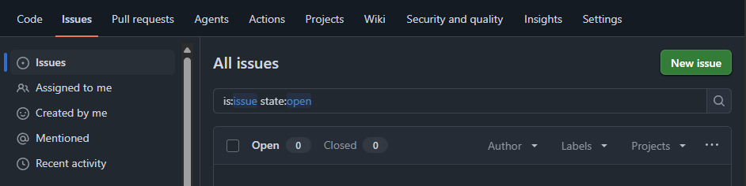

**Attēls 2.** Jauna Issue izveides logs uzdevumam `Izveidot funkciju saskaitit`.

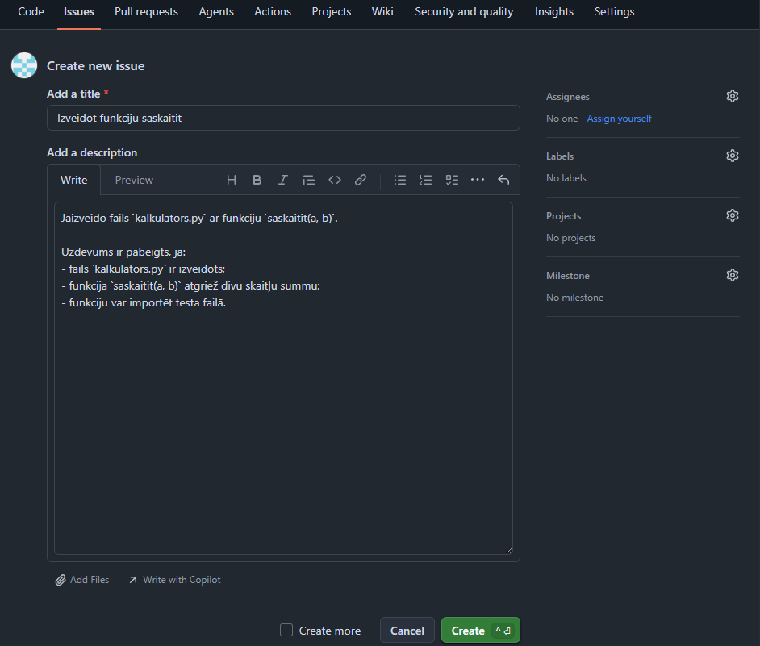

**Attēls 3.** Izveidots Issue `Izveidot funkciju saskaitit`.

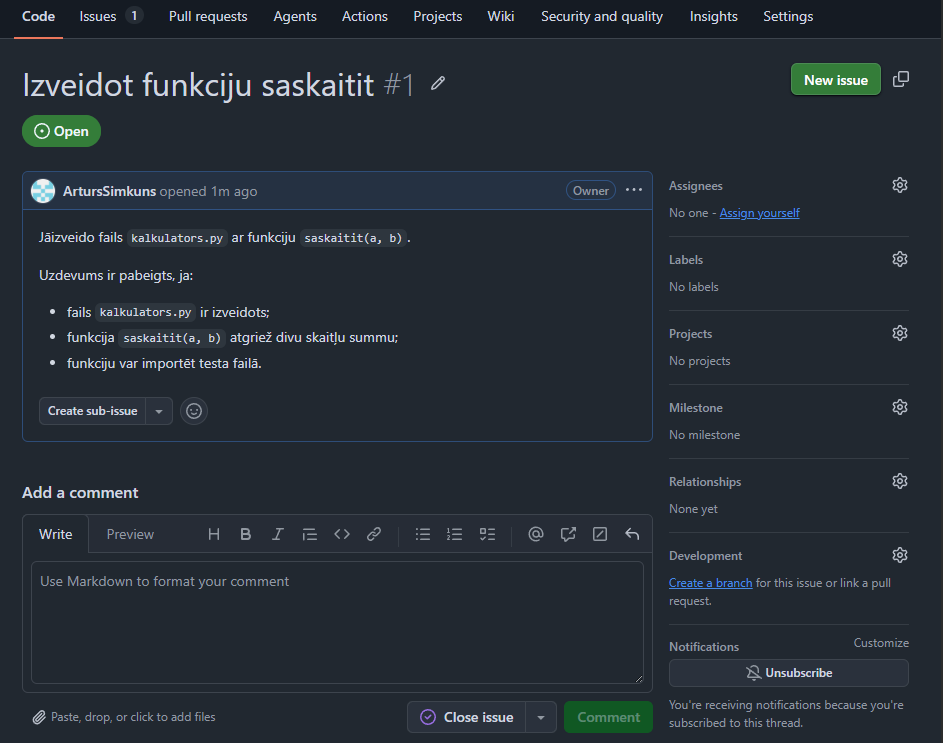

**Attēls 4.** Izveidots Issue `Uzrakstīt unittest testus`.

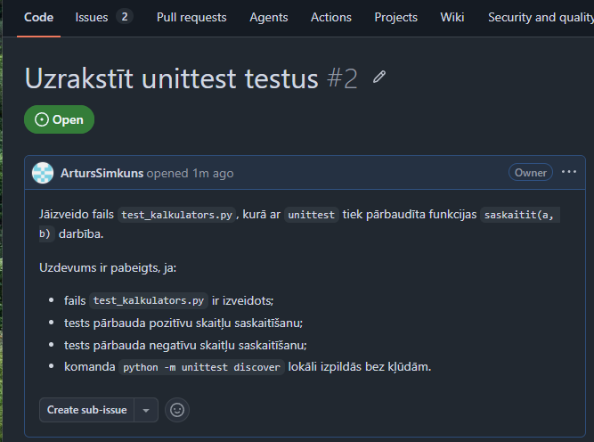

**Attēls 5.** Izveidots Issue `Iestatīt GitHub Actions CI`.

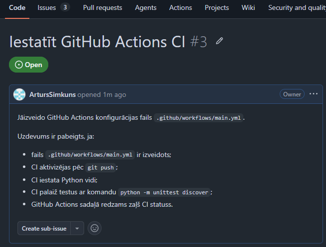

**Attēls 6.** Izveidots Issue `Atjaunināt README un Definition of Done`.

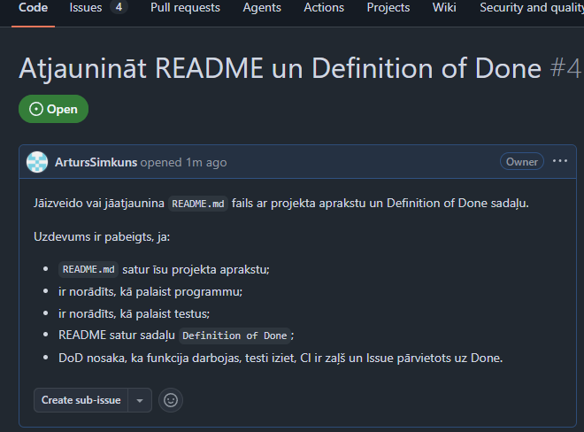

**Attēls 7.** GitHub Projects sadaļā tiek sākta jauna projekta izveide.

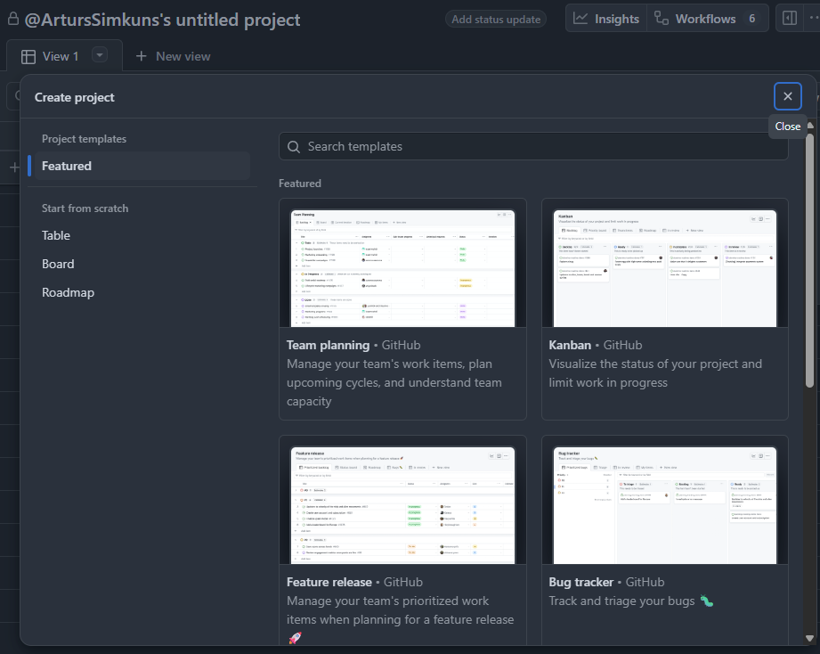

**Attēls 8.** GitHub Projects `Board` tipa projekta izveides logs.

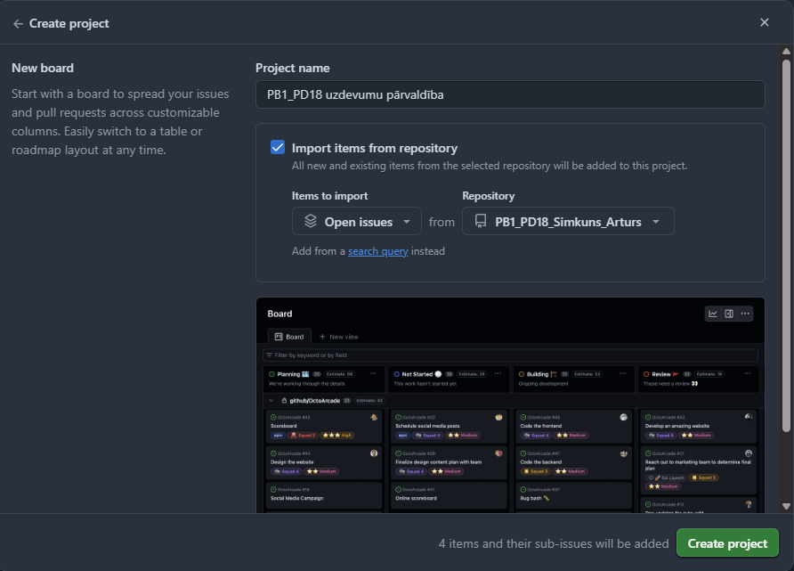

**Attēls 9.** Sākotnējais Kanban dēlis ar četriem Issues kolonnā `To Do`.

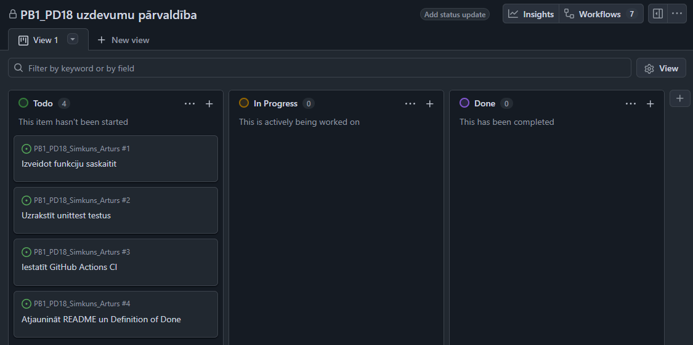

---

### 4.2. Uzdevums 2 - Programmas realizācija

- Ko darīju:
Izveidoju failu `kalkulators.py` ar funkciju `saskaitit(a, b)`. Funkcija atgriež divu skaitļu summu. Kods ir veidots kā importējams Python modulis, lai funkciju varētu pārbaudīt testa failā. Pievienoju arī `if __name__ == "__main__":` daļu, lai failu varētu palaist tieši un pārbaudīt piemēra izvadi.

- Izmantotās komandas / darbības:
Failā `kalkulators.py` ievietoju kodu:

```python
"""Vienkāršs kalkulatora modulis."""


def saskaitit(a, b):
    """Atgriež divu skaitļu summu."""
    return a + b


if __name__ == "__main__":
    print(f"Rezultāts: {saskaitit(5, 10)}")
```

Pārbaudīju, vai programmu var palaist lokāli:

```powershell
python .\kalkulators.py
```

Izvade:

```text
Rezultāts: 15
```

Pārbaudīju, vai funkciju var importēt no cita Python izsaukuma:

```powershell
python -c "from kalkulators import saskaitit; print(saskaitit(2, 3))"
```

Izvade:

```text
5
```

Izmaiņas pievienoju Git repozitorijam:

```powershell
git add .
git commit -m "Pievienota saskaitisanas funkcija"
git push
```

- Rezultāts:
Fails `kalkulators.py` ir izveidots. Funkcija `saskaitit(a, b)` atgriež pareizu summu. Programmu var palaist lokāli, un funkciju var importēt testos.

- Ekrānšāviņi:

**Attēls 10.** Kanban dēlī uzdevums `Izveidot funkciju saskaitit` pārvietots uz `In Progress`.

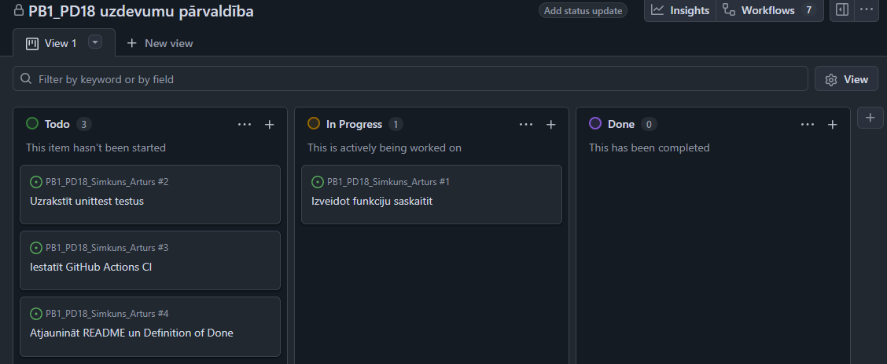

**Attēls 11.** Kanban dēlī uzdevums `Izveidot funkciju saskaitit` pārvietots uz `Done` pēc funkcijas izveides.

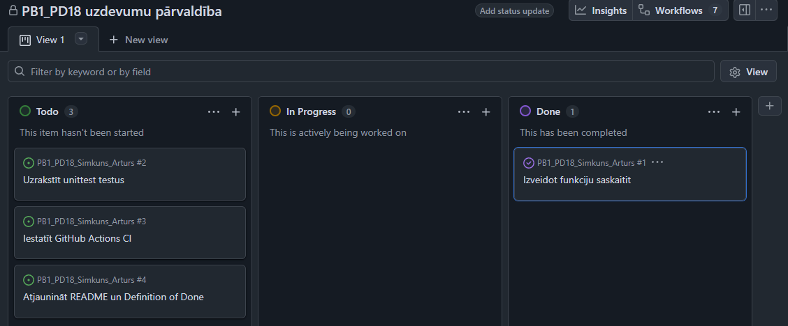

---

### 4.3. Uzdevums 3 - Testa izveide

- Ko darīju:
Izveidoju failu `test_kalkulators.py`, kurā ar `unittest` pārbaudīju funkcijas `saskaitit(a, b)` darbību. Tests pārbauda pozitīvu skaitļu, negatīvu skaitļu un nulles saskaitīšanu. Testa faila nosaukums sākas ar `test_`, lai `python -m unittest discover` to automātiski atrastu.

- Izmantotās komandas / darbības:
Failā `test_kalkulators.py` ievietoju kodu:

```python
"""Testi kalkulators.py modulim."""

import unittest

from kalkulators import saskaitit


class TestKalkulators(unittest.TestCase):
    """Testu klase funkcijai saskaitit."""

    def test_saskaitit_pozitivus_skaitlus(self):
        """Pārbauda pozitīvu skaitļu saskaitīšanu."""
        self.assertEqual(saskaitit(2, 3), 5)

    def test_saskaitit_negativus_skaitlus(self):
        """Pārbauda negatīvu skaitļu saskaitīšanu."""
        self.assertEqual(saskaitit(-1, -1), -2)

    def test_saskaitit_nulli(self):
        """Pārbauda saskaitīšanu ar nulli."""
        self.assertEqual(saskaitit(10, 0), 10)


if __name__ == "__main__":
    unittest.main()
```

Testus palaidu ar komandu:

```powershell
python -m unittest discover
```

Papildus testu failu palaidu tieši:

```powershell
python test_kalkulators.py
```

Izvade:

```text
...
----------------------------------------------------------------------
Ran 3 tests in 0.000s

OK
```

Izmaiņas pievienoju Git repozitorijam:

```powershell
git status
git add .
git commit -m "Pievienoti unittest testi saskaitisanas funkcijai"
git push
```

- Rezultāts:
Tests veiksmīgi pārbauda funkciju `saskaitit(a, b)`. Lokāli testi iziet bez kļūdām, un terminālī redzams rezultāts `OK`.

- Ekrānšāviņi:

**Attēls 12.** Kanban dēlī uzdevums `Uzrakstīt unittest testus` pārvietots uz `In Progress`.

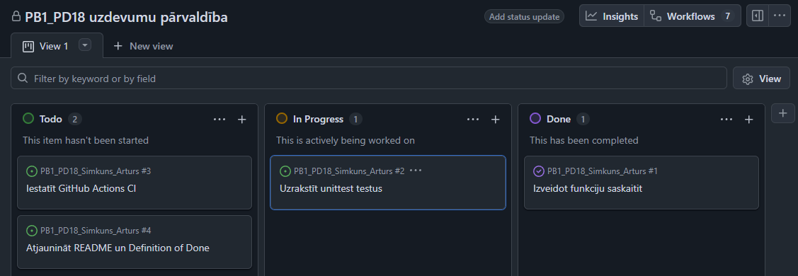

**Attēls 13.** Kanban dēlī uzdevums `Uzrakstīt unittest testus` pārvietots uz `Done` pēc lokālas testu pārbaudes.

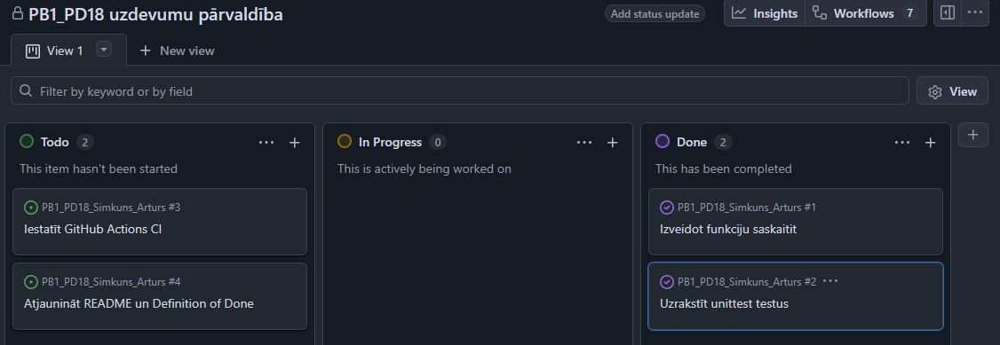

---

### 4.4. Uzdevums 4 - CI konfigurēšana

- Ko darīju:
Izveidoju GitHub Actions konfigurāciju failā `.github/workflows/main.yml`. Konfigurācija aktivizējas pēc katra `git push`, iestata Python vidi un palaiž testus ar komandu `python -m unittest discover`.

- Izmantotās komandas / darbības:
Failā `.github/workflows/main.yml` ievietoju konfigurāciju:

```yaml
name: Python CI pārbaude

on: [push]

jobs:
  test:
    runs-on: ubuntu-latest

    steps:
      - name: Ielādēt kodu no GitHub
        uses: actions/checkout@v3

      - name: Uzstādīt Python versiju
        uses: actions/setup-python@v4
        with:
          python-version: '3.10'

      - name: Atjaunināt pip
        run: python -m pip install --upgrade pip

      - name: Palaist automātiskos testus
        run: python -m unittest discover
```

Pirms `push` pārbaudīju testus lokāli:

```powershell
python -m unittest discover
```

Izvade:

```text
...
----------------------------------------------------------------------
Ran 3 tests in 0.000s

OK
```

Izmaiņas pievienoju Git repozitorijam:

```powershell
git status
git add .
git commit -m "Pievienota GitHub Actions CI konfiguracija"
git push
```

Pēc `git push` GitHub repozitorijā atvēru sadaļu `Actions` un pārbaudīju workflow `Python CI pārbaude` izpildi.

- Rezultāts:
Pēc `git push` GitHub sadaļā `Actions` parādījās CI izpildes process. Tā kā testi bija korekti, CI statuss kļuva zaļš.

- Ekrānšāviņi:

**Attēls 14.** Kanban dēlī uzdevums `Iestatīt GitHub Actions CI` darba gaitā.

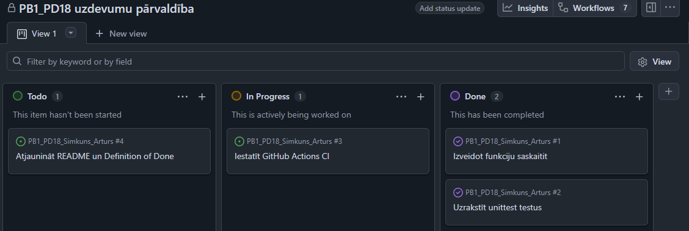

**Attēls 15.** GitHub Actions sadaļā redzama workflow `Python CI pārbaude` izpilde.

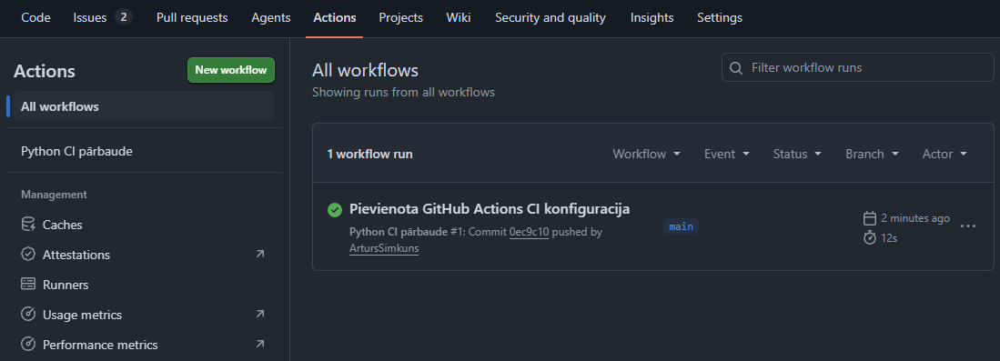

**Attēls 16.** GitHub Actions konkrētā workflow izpilde ir veiksmīga.

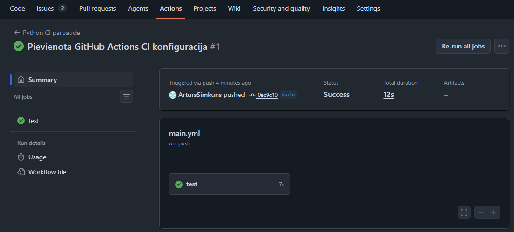

**Attēls 17.** Kanban dēlī CI konfigurācijas uzdevums pārvietots uz `Done` pēc veiksmīgas pārbaudes.

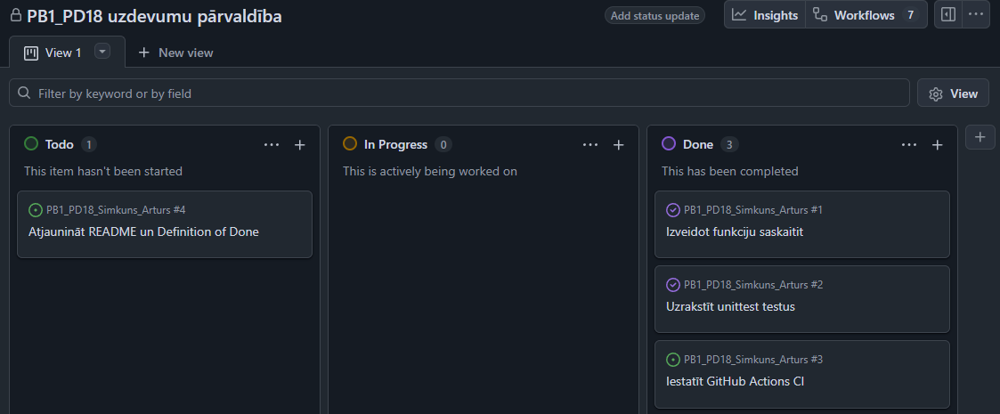

---

### 4.5. Uzdevums 5 - CI eksperiments

- Ko darīju:
Veicu CI eksperimentu, apzināti sabojājot vienu testu. Testā pareizo sagaidāmo vērtību `5` nomainīju uz nepareizu vērtību `6`. Pēc tam veicu `commit` un `push`, lai GitHub Actions parādītu sarkanu CI statusu. Pēc kļūdas novērošanas testu salaboju un atkārtoti nosūtīju izmaiņas uz GitHub, iegūstot zaļu CI statusu.

- Izmantotās komandas / darbības:
Failā `test_kalkulators.py` apzināti nomainīju pareizo vērtību:

```python
    def test_saskaitit_pozitivus_skaitlus(self):
        """Pārbauda pozitīvu skaitļu saskaitīšanu."""
        self.assertEqual(saskaitit(2, 3), 6)
```

Lokāli palaidu testus:

```powershell
python -m unittest discover
```

Kļūdas izvade:

```text
..F
======================================================================
FAIL: test_saskaitit_pozitivus_skaitlus (test_kalkulators.TestKalkulators.test_saskaitit_pozitivus_skaitlus)
Pārbauda pozitīvu skaitļu saskaitīšanu.
----------------------------------------------------------------------
Traceback (most recent call last):
  File "C:\Users\robo\Documents\BUTS\Praktiskie_darbi\05 Programmas koda rakstīšana (Kodēšana)\PB1_PD18 CI pamati un uzdevumu pārvaldība\PB1_PD18_Simkuns_Arturs\test_kalkulators.py", line 13, in test_saskaitit_pozitivus_skaitlus
    self.assertEqual(saskaitit(2, 3), 6)
    ~~~~~~~~~~~~~~~~^^^^^^^^^^^^^^^^^^^^
AssertionError: 5 != 6

----------------------------------------------------------------------
Ran 3 tests in 0.001s

FAILED (failures=1)
```

Kļūdaino testa versiju nosūtīju uz GitHub:

```powershell
git status
git add .
git commit -m "Apzinati sabojats tests CI eksperimentam"
git push
```

Pēc sarkanā CI statusa novērošanas testu salaboju:

```python
    def test_saskaitit_pozitivus_skaitlus(self):
        """Pārbauda pozitīvu skaitļu saskaitīšanu."""
        self.assertEqual(saskaitit(2, 3), 5)
```

Salaboto versiju nosūtīju uz GitHub:

```powershell
git status
git add .
git commit -m "Salabots tests pec CI eksperimenta"
git push
```

- Rezultāts:
Pēc apzināti sabojāta testa GitHub Actions sadaļā bija redzams sarkans CI statuss. Pēc testa labošanas un atkārtota `git push` CI statuss kļuva zaļš. Eksperiments parādīja, ka CI palīdz ātri pamanīt kļūdas pēc koda nosūtīšanas uz GitHub.

- Ekrānšāviņi:

**Attēls 18.** GitHub Actions sadaļā redzama sarkana CI izpilde pēc apzināti sabojāta testa.

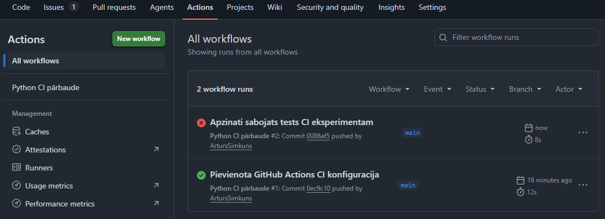

**Attēls 19.** GitHub Actions kļūdas logs ar `AssertionError: 5 != 6`.

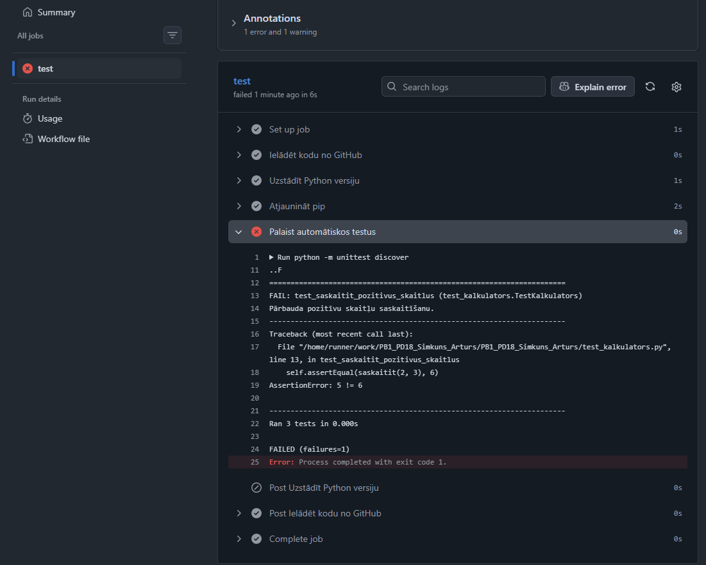

**Attēls 20.** GitHub Actions sadaļā redzama salabotā izpilde ar zaļu statusu.

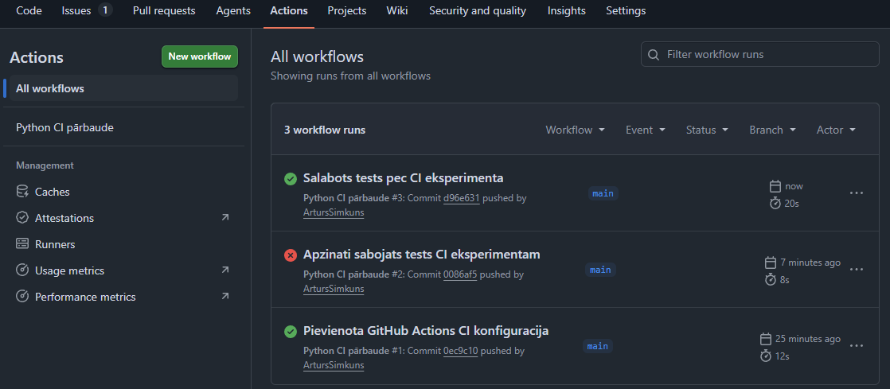

---

### 4.6. Uzdevums 6 - Definition of Done un refleksija

- Ko darīju:
Atjaunināju `README.md` failu, pievienojot projekta aprakstu, lokālas programmas palaišanas instrukciju, testu palaišanas instrukciju, CI procesa aprakstu un `Definition of Done` sadaļu. Izveidoju arī failu `ci_refleksija.md`, kurā atbildēju uz jautājumiem par kļūdainu testu, CI nozīmi, DoD lomu komandā un attieksmes maiņu pret `git push`.

- Izmantotās komandas / darbības:
`README.md` failā pievienoju sadaļu:

```md
## Definition of Done

Uzdevums ir pabeigts, ja:

- funkcija darbojas;
- tests iziet;
- CI ir zaļš;
- Issue pārvietots uz `Done`.
```

Failā `ci_refleksija.md` atbildēju uz jautājumiem:

```md
# CI refleksija

## 1. Kas notika, kad tests bija kļūdains?

Kad testā apzināti nomainīju pareizo sagaidāmo vērtību uz nepareizu, lokālā testu palaišana parādīja kļūdu. Pēc `git push` arī GitHub Actions sadaļā CI statuss kļuva sarkans. Tas parādīja, ka automatizētā pārbaude atrod kļūdu arī tad, ja kods jau ir nosūtīts uz GitHub.

## 2. Kāpēc CI palīdz ātri pamanīt kļūdas?

CI palīdz ātri pamanīt kļūdas, jo testi tiek palaisti automātiski pēc katra `git push`. Nav jāatceras manuāli pārbaudīt katru izmaiņu. Ja kāds tests neiziet, GitHub Actions uzreiz parāda kļūdu un neļauj uzskatīt darbu par pilnībā pabeigtu.

## 3. Kā DoD palīdz komandai?

Definition of Done palīdz komandai vienoties, kad uzdevumu drīkst uzskatīt par pabeigtu. Tas samazina pārpratumus, jo nepietiek tikai uzrakstīt kodu. Uzdevums ir pabeigts tikai tad, ja funkcija darbojas, tests iziet, CI ir zaļš un Issue ir pārvietots uz `Done`.

## 4. Kā mainījās tava attieksme pret `git push`?

Pēc CI eksperimenta `git push` vairs neuztveru tikai kā koda nosūtīšanu uz GitHub. Tas ir arī pārbaudes sākšanas brīdis. Pēc `push` ir jāpaskatās GitHub Actions statuss, jo tikai zaļš CI apliecina, ka pēdējās izmaiņas ir pārbaudītas.
```

Pēc failu atjaunināšanas pārbaudīju GitHub Actions statusu.

- Rezultāts:
`README.md` satur `Definition of Done` sadaļu. Fails `ci_refleksija.md` satur argumentētas atbildes uz visiem četriem jautājumiem. Pēc `git push` GitHub Actions CI statuss ir zaļš.

- Ekrānšāviņi:

**Attēls 21.** GitHub Actions sadaļā redzamas vairākas CI izpildes, tai skaitā veiksmīgā izpilde pēc README un refleksijas atjaunināšanas.

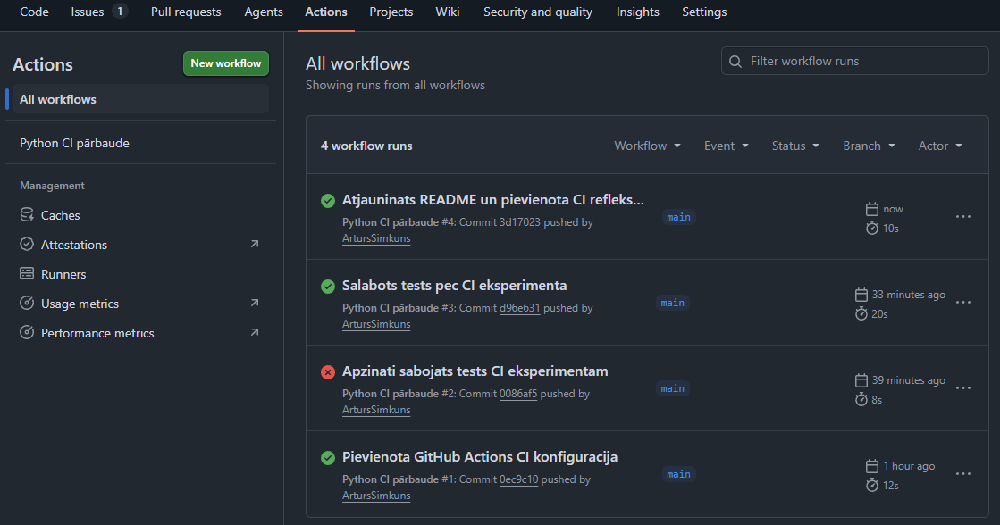

**Attēls 22.** Kanban dēlī visi četri uzdevumi ir pārvietoti uz `Done`.

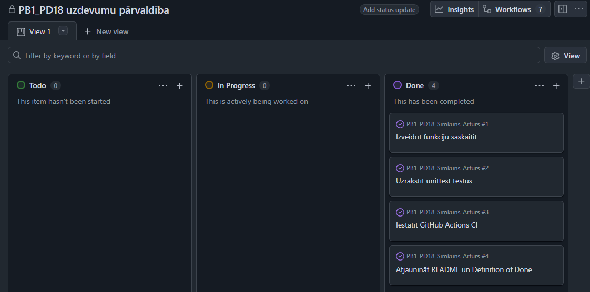

---

## 5. Problēmas un to risinājumi

- Problēmas apraksts:
README faila sagatavošanas laikā sākotnēji radās Markdown formatēšanas problēma: ievietojot vienu koda bloku cita koda bloka iekšpusē, daļa teksta tika attēlota ārpus paredzētā Markdown piemēra.

- Kļūdas ziņojums (ja bija):
Nebija programmas kļūdas ziņojuma, bet GitHub/Markdown priekšskatījumā bija redzams nepareizs formatējums: daļa no `README.md` satura vizuāli izskatījās kā teksts ārpus faila piemēra.

- Risinājums:
Pārveidoju `README.md` saturu tā, lai katrs komandu piemērs būtu atsevišķā Markdown koda blokā un nebūtu liekas ārējā koda bloka struktūras. Rezultātā GitHub priekšskatījums pareizi attēlo gan tekstu, gan `bash` komandas.

- Ko no tā iemācījos:
Markdown failā jāseko līdzi tam, lai koda bloki būtu pareizi atvērti un aizvērti. Ja vienā dokumentā jāparāda vairāki koda piemēri, katram piemēram jābūt skaidri nodalītam.

Papildu problēma tika apzināti radīta CI eksperimentā. Kļūdainā testa gadījumā `unittest` parādīja `AssertionError: 5 != 6`, un GitHub Actions statuss kļuva sarkans. Problēmu atrisināju, atjaunojot pareizo sagaidāmo vērtību `5` testā un atkārtoti veicot `git push`.

---

## 6. Secinājumi

- Ko jaunu iemācījos šajā darbā?
Iemācījos sasaistīt GitHub Issues, GitHub Projects, Python testus un GitHub Actions CI vienā darba plūsmā. Sapratu, ka CI automātiski pārbauda kodu pēc `git push` un palīdz ātri pamanīt kļūdas.

- Kas bija grūtākais?
Grūtākais bija saprast, ka CI statuss ir jāuztver kā daļa no darba pabeigšanas kritērijiem, nevis tikai kā papildu pārbaude. Tāpat uzmanība bija jāpievērš YAML atkāpēm un Markdown koda bloku formatēšanai.

- Kas izdevās vislabāk?
Vislabāk izdevās izveidot vienkāršu Python funkciju, uzrakstīt `unittest` testus un panākt, ka GitHub Actions automātiski tos palaiž pēc `git push`.

- Ko darītu citādi nākamreiz?
Nākamreiz jau sākumā sakārtotu Issues un Kanban statusus precīzi pēc darba prasībām, kā arī agrāk pārbaudītu README priekšskatījumu, lai uzreiz pamanītu Markdown formatēšanas kļūdas.

---

## 7. Pašvērtējums

| Kritērijs | Maks. punkti | Mani punkti |
|------------|-------------|-------------|
| Repozitorijs, Issues un Kanban darba plūsma | 20 | 20 |
| Programmas fails `kalkulators.py` ar funkciju `saskaitit(a, b)` | 20 | 20 |
| `unittest` testu izveide un lokāla izpilde | 20 | 20 |
| GitHub Actions CI konfigurācija un CI eksperiments | 20 | 20 |
| README, Definition of Done, refleksija un atskaite | 20 | 20 |

Kopā punkti: 100 / 100

Pamatojums: visi uzdevumā prasītie faili ir izveidoti, testi lokāli iziet bez kļūdām, GitHub Actions CI statuss pēc gala labojuma ir zaļš, README satur Definition of Done sadaļu, un `ci_refleksija.md` satur argumentētas atbildes uz visiem prasītajiem jautājumiem.

---

## 8. Pielikumi

- Pielikums 1 - `kalkulators.py`, Python programmas fails ar funkciju `saskaitit(a, b)`.
- Pielikums 2 - `test_kalkulators.py`, `unittest` testa fails.
- Pielikums 3 - `.github/workflows/main.yml`, GitHub Actions CI konfigurācijas fails.
- Pielikums 4 - `README.md`, projekta apraksts ar Definition of Done sadaļu.
- Pielikums 5 - `ci_refleksija.md`, refleksija par CI eksperimentu.
- Pielikums 6 - `Piezimes.md`, darba gaitas piezīmes un komandu secība.
- Pielikums 7 - `Pielikumi/atteli/attels001.png`, GitHub Issues sākuma skats.
- Pielikums 8 - `Pielikumi/atteli/attels002.png`, jauna Issue izveides logs.
- Pielikums 9 - `Pielikumi/atteli/attels003.png`, Issue `Izveidot funkciju saskaitit`.
- Pielikums 10 - `Pielikumi/atteli/attels004.png`, Issue `Uzrakstīt unittest testus`.
- Pielikums 11 - `Pielikumi/atteli/attels005.png`, Issue `Iestatīt GitHub Actions CI`.
- Pielikums 12 - `Pielikumi/atteli/attels006.png`, Issue `Atjaunināt README un Definition of Done`.
- Pielikums 13 - `Pielikumi/atteli/attels007.png`, GitHub Projects izveides sākums.
- Pielikums 14 - `Pielikumi/atteli/attels008.png`, `Board` tipa projekta izvēle.
- Pielikums 15 - `Pielikumi/atteli/attels009.png`, Kanban dēlis ar sākotnējiem Issues.
- Pielikums 16 - `Pielikumi/atteli/attels010.png`, funkcijas uzdevums darba gaitā.
- Pielikums 17 - `Pielikumi/atteli/attels011.png`, funkcijas uzdevums statusā `Done`.
- Pielikums 18 - `Pielikumi/atteli/attels012.png`, testu uzdevums darba gaitā.
- Pielikums 19 - `Pielikumi/atteli/attels013.png`, testu uzdevums statusā `Done`.
- Pielikums 20 - `Pielikumi/atteli/attels014.png`, CI uzdevums darba gaitā.
- Pielikums 21 - `Pielikumi/atteli/attels015.png`, GitHub Actions workflow saraksts.
- Pielikums 22 - `Pielikumi/atteli/attels016.png`, veiksmīga GitHub Actions izpilde.
- Pielikums 23 - `Pielikumi/atteli/attels017.png`, CI uzdevums statusā `Done`.
- Pielikums 24 - `Pielikumi/atteli/attels018.png`, sarkans CI statuss pēc apzināti sabojāta testa.
- Pielikums 25 - `Pielikumi/atteli/attels019.png`, GitHub Actions kļūdas logs.
- Pielikums 26 - `Pielikumi/atteli/attels020.png`, zaļš CI statuss pēc testa labošanas.
- Pielikums 27 - `Pielikumi/atteli/attels021.png`, GitHub Actions pēc README un refleksijas atjaunināšanas.
- Pielikums 28 - `Pielikumi/atteli/attels022.png`, Kanban dēlis ar visiem uzdevumiem statusā `Done`.
